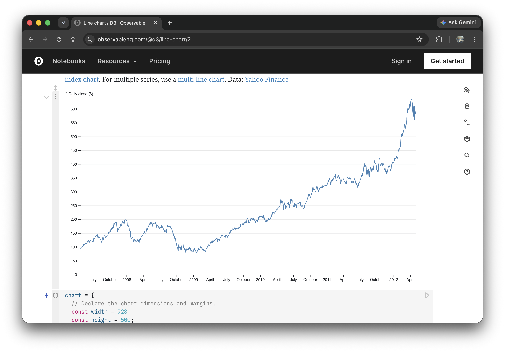
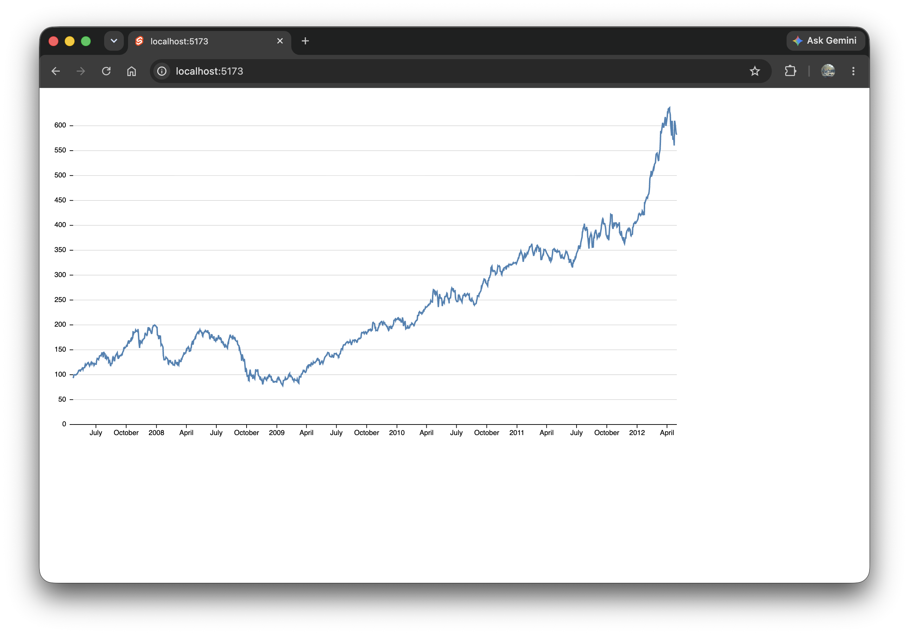
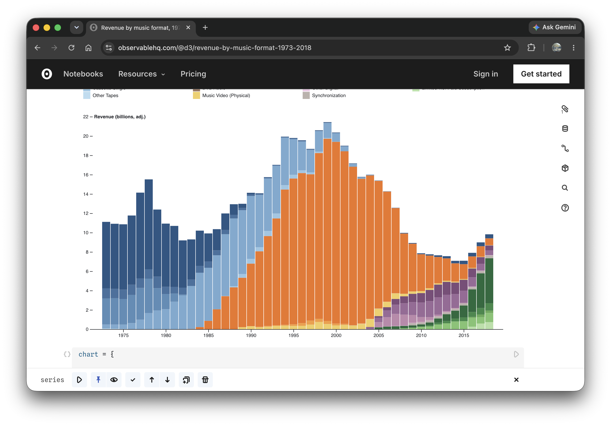
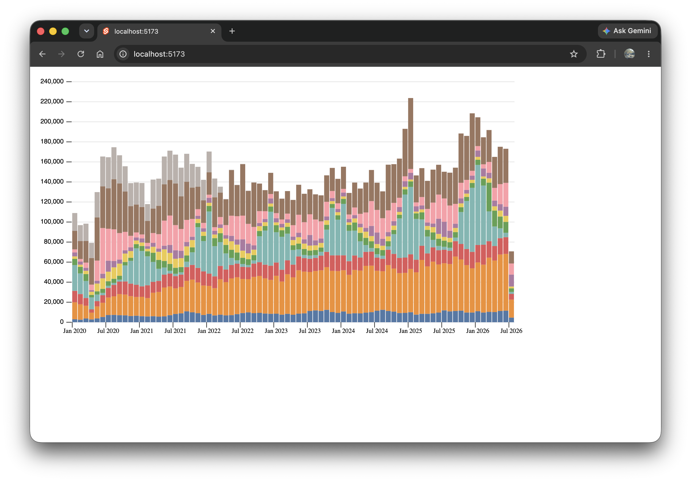

# Homework-3

### Chart 1
[Original d3 chart](https://observablehq.com/@d3/line-chart/2) (left) and my Svelte version (right)

#### Biggest challenges:
This chart was mostly simple to recreate in Svelte. One issue I ran into is that the x-axis is a date type and not simply an integer. I used the `scaleUtc` to help deal with this. I also had to consult my friend chatGPT to work through adding axis labels only every 3 months and that show the year instead of January every time.

### Chart 2
[Original d3 chart](https://observablehq.com/@d3/revenue-by-music-format-1973-2018) (left) and my Svelte version (right)

#### Biggest challenges:
This one was a lot harder – making the stacked columns was difficult, and the data I brought in was in long format from the [NYC Open Data export](/src/lib/components/stories/311_requests.json), but d3 needed it to be wide. I feel confident about my understanding of the code, though much of it was written with the help of chatGPT as I was learning how to do it. I also am not too happy about the colors/categories, and still do not have a color key on the chart, but gained some experience in making a stacked chart like this.